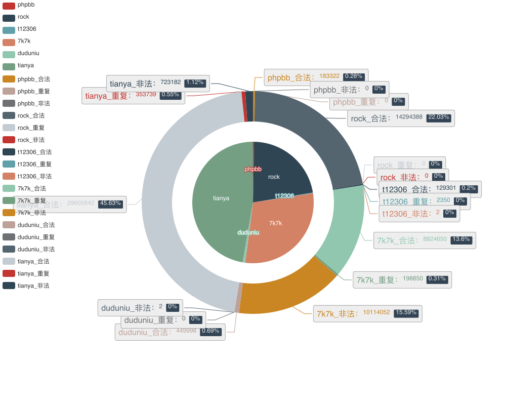
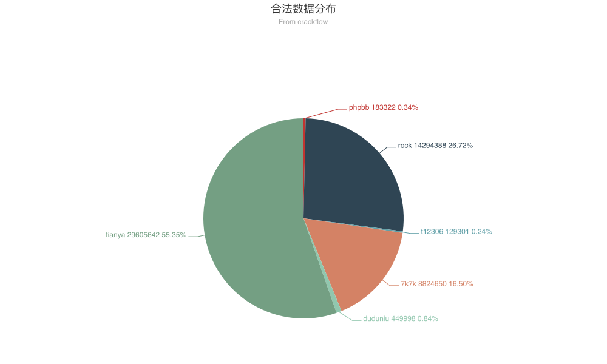
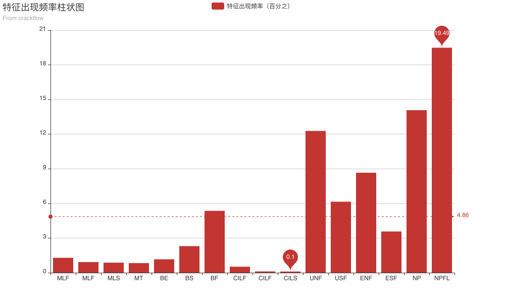

# 数据整理

由于本论文综合了中外多起口令泄漏数据为一个大的数据集，数据的质量参差不齐，为了确保实验的准确性，又要保证有足够多的实验数据，需要进行较为复杂的清洗、修补工作。在清洗以后，还需要将数据整理解析为实验中需要的结构，并提取特征做进一步的特征工程。最后将标准化的特征数据进行持久化保存，以备实验使用。下面将整个数据整理工作分为 `数据清洗`、 `特征工程` 来进行介绍：

## 数据组成

初始数据集（下文中称为 `A集`）由7个通过口令泄漏事件获得的口令数据集组成，分别是：

  + `7k7k：` 数据库在 `2011年12月` 由黑客通过网络远程大规模猜解所破译，非数据库入侵。该数据库有 `19,137,552` 份原始数据，包含了 **口令**、 **用户名** 信息。
  + `checkin：` 数据库在 `2013年03月` 由黑客通过数据库渗透技术攻破。该数据库有 `19,260,381` 份原始数据，包含了 **用户的真实姓名**、 **身份证明类型**、 **性别**、 **地址**、 **座机号码**、**手机号码**、 **传真**、 **身份证明号码**、 **邮箱**、 **口令** 信息。但是由于缺少口令数据，不能作为实验数据使用。
  + `duduniu：` 数据库在 `2011年12月` 由黑客通过网络远程大规模猜解所破译，非数据库入侵。该数据库有 `450,000` 份原始数据，包含了 **用户名**、 **邮箱**、 **口令** 信息。
  + `duowan：` 数据库在 `2011年12月` 由黑客通过网络远程大规模猜解所破译，非数据库入侵。该数据库有 `2,375,073` 份原始数据，包含了 **用户名**、**邮箱**、**口令** 信息。但是由于口令是被编码过的，不能作为明文口令实验数据使用。
  + `t12306：` 数据库在 `2014年12月` 由黑客通过漏洞拖库后撞库破解。该数据库有 `131,651` 份原始数据，包含了 **用户真实姓名**、**邮箱**、**身份证号码**、**用户名**、**口令**、**手机号码** 信息。
  + `phpbb：` 数据库在 `2009年2月` 由黑客破解。该数据库有 `183,322` 份原始数据，包含了 **口令**、 **出现次数** 信息。但是由于该网站是外国网站，其中的口令习惯和国内口令习惯存在差异，而且不包含用户信息，所以将其作为辅助实验的数据集进行使用。
  + `rockyou：` 数据库由黑客破解，获取了大量的明文口令。该数据库有 `14,294,388` 份原始数据，包含了 **口令**、 **出现次数** 信息。但是由于该网站是外国网站，其中的口令习惯和国内口令习惯存在差异，而且不包含用户信息，所以将其作为辅助实验的数据集进行使用。

这些数据数量非常庞大并且包含的用户信息也非常的多，这对我们了解口令的组成、口令与用户信息之间的关联关系非常有帮助。由于本文主要研究的是中文环境下口令与用户信息的关系，所以经过筛选后选取 `7k7k`，`duduniu`, `duowan`, `t12306` 组成了主要实验数据集（下文中简称为 `B集`），总有 `34,869,552` 份原始数据。由 `phpbb`, `rockyou` 组成了辅助实验数据集（下文中简称为 `C集`），总有 `13,451,887` 份原始数据。

在B集中，获取的特征是：**口令**、 **用户的真实姓名**、 **手机号码**、 **身份证明号码**、 **邮箱**、 **用户名**

在C集中，获取的特征是：**口令**、 **出现次数**

## 数据清洗

由于数据集中的用户信息数据质量参差不齐：**部分用户信息缺失**、**部分用户信息出现大量乱码不能使用**、**部分用户信息中出现少量乱码，经过清洗以后还能使用**，我们需要较为复杂的数据清洗工作，先对含有少量乱码的数据进行修补，然后筛选出能够被使用的数据。在这个过程当中我们先按照规则对用户信息进行修补，完成以后再按照规则来判定数据是否合法，筛选出所有能够被使用的数据，并且会通过将一个用户的所有信息进行 `hash` 编码来进行判重（同一用户在同一平台认为是重复数据）。

### 口令
  + 修补规则：将口令中所有的空格去除。  
  + 筛选规则：口令长度小于等于30，大于等于3，仅允许出现 ```!"#$%&'()*+,-./:;<=>?@[\]^_`{|}~ ``` 等特殊字符和数字、大小写字母。
### 用户的真实姓名
  + 修补规则：去除所有的空格和 ```[!"#$%&'()*+,-./:;<=>?@[\]^_`{|}~]``` 字符。
  + 筛选规则：过滤出真实姓名中出现的所有的中文，然后拼凑出最终的真实姓名，且长度不得超过4。
### 邮箱
  + 修补规则：去除邮箱中出现的所有空格和全局的 `"[]` 乱码（通过观察 `duduniu` 数据发现大量邮箱中出现这样的乱码），以及邮箱开头出现的 ```^[!"#$%&'()*+,-./:;<=>?@[\]^_`{|}~]*``` 等特殊符号。
  + 筛选规则：通过 `^[a-z0-9]+([._\\-]*[a-z0-9])*@([a-z0-9]+[-a-z0-9]*[a-z0-9]+.){1,63}[a-z0-9]+$` 正则表达式进行判断是否合法。
### 用户名
  + 修补规则：去除用户名中出现的所有空格。
  + 筛选规则：如果出现了连续3个及以上的 `?`，则是用户名中出现了不能正常解码的字符，这样的用户名判定为非法的用户名。并且长度需要大于5，只能出现 ```!"#$%&'()*+,-./:;<=>?@[\]^_`{|}~ ``` 等特殊字符和数字、大小写字母。
### 身份证号码
  + 修补规则：去除身份证号码中出现的所有的空格，```^[!"#$%&'()*+,-./:;<=>?@[\]^_`{|}~]*``` 等特殊符号。
  + 筛选规则：只允许出现数字，且长度为15或者18。
### 手机号码
  + 修补规则：去除手机号码中出现的所有的空格，```^[!"#$%&'()*+,-./:;<=>?@[\]^_`{|}~]*``` 等特殊符号。
  + 筛选规则：通过 `^(13[0-9]|14[579]|15[0-3,5-9]|16[6]|17[0135678]|18[0-9]|19[89])\d{8}$` 正则表达式进行判断是否合法。

通过以上的规则，会清除掉违规的数据，并且会将半合法数据转变为合法数据。当然如果原始数据集中缺少某个信息，不进行填补，保持为空。



通过统计后获得上图：

图中展示了各个数据集中的合法数据、重复数据和非法数据的数量，可以看到 `7k7k` 有近半数据均是非法数据，数据质量较低。其他数据集的数据质量较高，非法数据和重复数据均较少。

数据集 | 合法数据 | 非法数据 | 重复数据 | 数据总量
----|----|----|----|----
tianya | 29695642 | 723182 | 353738 | 30772562
12306 | 129301 | 0 | 2350 | 131651
7k7k | 8824650 | 198850 | 10114052 | 19137552
duduniu | 449998 | 2 | 0 | 450000
phpbb | 183322 | 0 | 0 | 183322
rockyou | 14294388 | 0 | 0 | 14294388
total | 53577301 | 922034 | 10470140 | 64564475



最后形成了该合法数据集，可以通过上图看到数据的分布情况。

## 特征工程

通过对口令的初步分析，这些原始用户信息数据不仅部分较长，而且部分还有中文，是不会直接出现在口令中，所以将从这些原始数据当中提取潜在的特征，并会通过计算这些潜在特征在口令中的出现频率来筛选出最优的特征作为实验特征。

特征 | 用户信息 | 提取规则 | 缩写
----|----|------|----
手机号后4位 | 手机号码 | 提取手机号码最后4位 | MLF
手机号后5位 | 手机号码 | 提取手机号码最后5位 | MLF`
手机号后6位 | 手机号码 | 提取手机号码最后6位 | MLS
手机号     | 手机号码 | 提取手机号码       | MT
身份证后4位 | 身份证号码  | 提取身份证号码最后4位 | CILF
身份证后5位 | 身份证号码  | 提取身份证号码最后5位 | CILF‘
身份证后6位 | 身份证号码  | 提取身份证号码最后6位 | CILS
8位形式的生日 | 身份证号码 | 提取身份证6-13位(20100101) | BE
6位形式的生日 | 身份证号码 | 提取身份证6-13位后处理(100101) | BS
4位形式的生日 | 身份证号码 | 提取身份证6-13位后处理(100101) | BS
用户名数字片段 | 用户名 | 提取用户名中的连续数字片段 | UNF
用户名字符片段 | 用户名 | 提取用户名中的连续字符片段 | USF
邮箱数字片段 | 邮箱 | 提取邮箱中 `@` 字符前的连续数字片段 | ENF
邮箱字符片段 | 邮箱 | 提取邮箱中 `@` 字符前的连续字符片段 | ESF
用户真实姓名拼音 | 用户真实姓名 | 将真实姓名转为为拼音 | NPYL
用户真实姓名拼音首字母 | 用户真实姓名 | 将真实姓名转为拼音后提取首字母 | NPFL

在提取了所有的特征以后，我们会查看口令中特征的出现次数，再根据特征的总量计算特征的出现频率。`特征的出现频率 = 口令中特征的出现次数 / 特征的总量`，这个指标可以看出用户是否喜欢使用该特征来构成口令，所以出现频率越高的特征，越应该被我们重视，加入到最后的实验特征当中。



上图中横坐标是各个特征对应的缩写，纵坐标对应的是特征的出现频率（单位为%），最高值是 `NPFL` (用户的真实姓名拼音首字母)，最低值是 `CILS` （身份证后6位）。当然我们会发现特征之间是存在一些包含关系的，比如手机号后4为出现次数肯定包含了手机后5位的出现次数，不过这对于选取更优秀的特征是没有影响的，并且也能通过这种统计观察口令中用户信息的分布情况。

特征 | 特征出现次数 | 特征总数 | 特征出现频率
----|----|----|----
手机号后4位 | 1671 | 129243 | 1.29%
手机号后5位 | 1195 | 129243 | 0.92%
手机号后6位 | 1125 | 129243 | 0.87%
手机号     | 1070 | 129243 | 0.82%
身份证后4位 | 668 | 129064 | 0.05%
身份证后5位 | 136 | 129064 | 0.05%
身份证后6位 | 127 | 129064 | 0.01%
8位形式的生日 | 1492 | 129064 | 1.15%
6位形式的生日 | 2965 | 129064 | 2.29%
4位形式的生日 | 6920 | 129064 | 5.35%
用户名数字片段 | 2032501 | 16551960 | 12.28%
用户名字符片段 | 1018749 | 16551960 | 6.15%
邮箱数字片段 | 3351729 | 38708842 | 8.65%
邮箱字符片段 | 1380816 | 38708842 | 3.56%
用户真实姓名拼音 | 18166 | 129062 | 14.08%
用户真实姓名拼音首字母 | 25160 | 129062 | 19.49%

通过以上的统计，我们最终选取了出现频率较高的 **4位形式的生日**、 **用户真实姓名拼音**、 **用户名字符片段**、 **邮箱数字片段**、 **邮箱字符片段**、 **用户真实姓名拼音**、 **用户真实姓名拼音首字母** 以及出现频率较低的 **手机号后4位**、 **手机号后6位** 作为补充。