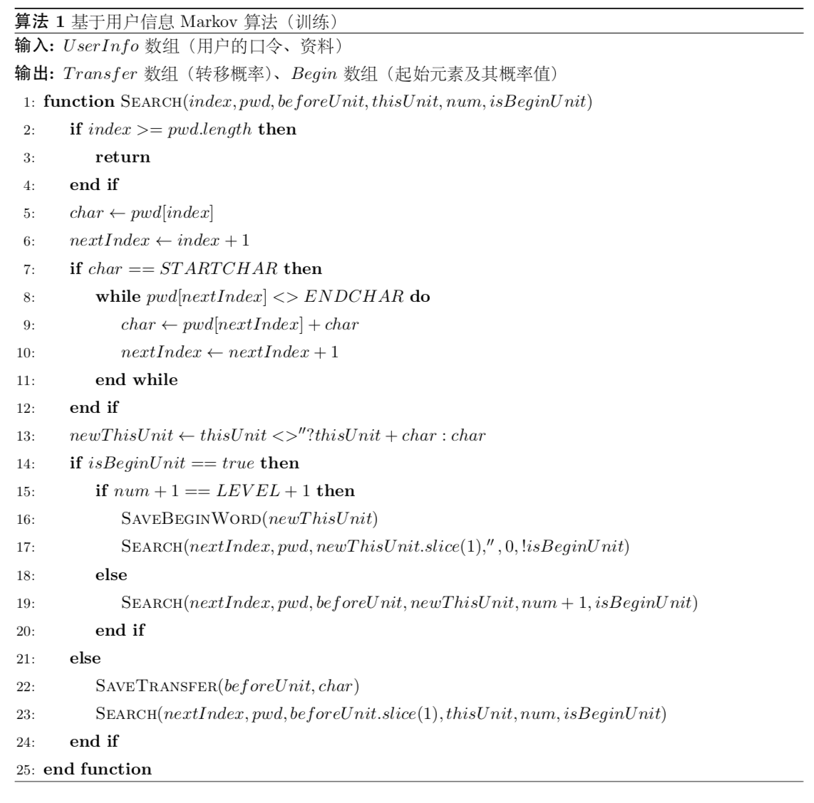

# Markov-Base on the user information

## Markov-chain

`Markov-chain` 算法（全称呼 `discrete-time Markov chain`，离散时间马尔可夫链），该算法是在马尔可夫假设下用来描述随机场中状态转移的模型。指出下一个状态只与当前状态有关系，和再之前的状态全部无关。该算法在2005年就由 `Narayanan` 和 `Shmatikov` 提出了基于 `Markov` 链的先进口令攻击算法，该算法由传统马尔可夫链映射到口令空间，提出口令中的一个字符只与这个字符的 `n-grams` 有关，即一个字符的出现全由前n个字符确定，与其他的字符再无关系。 例如 `password` 的口令在4阶马尔可夫链中的概率值是 `P('password1234') = P('passw') * P('o' | 'assw') * P('r' | 'sswo') * P('d' | 'swor')`。在训练过程中，我们其实是用两个概率集合来描述口令空间，一个是初始单元概率分布（即例子中的 `P('passw')`），第二个是概率转移集合（即例子中的 `P('o' | 'assw'), P('r' | 'sswo'), P('d' | 'swor')`），通过训练可以将口令空间归纳到这两个概率集合当中。而在破解的时候，我们先在初始单元概率分布当中找到概率值最高的单元作为起始，然后遍历整个 `n-grams` 树。该算法主要关注的是多个字符之间的关联关系，通过对训练集的学习获得其中的关联关系，但是也存在多个不足之处：

第一是遍历完一颗 `n-grams` 树之后再遍历第二颗的情况是很不合适的，这样不能让概率值高的口令出现在前面与目标口令匹配，当然在后来的 `OMEN` 论文当中，对这个问题作出了一系列的改进，在该论文中也有一部分的吸收。第二是在训练时只对字符之间的关系进行了归纳，而并不关系口令的结构组成，通过之前业内学者的研究证明口令中存在结构特点可循的，而不关系结构组成会导致生成很多非正常结构的无效测试口令，大大降低了我们破解的速度。第三是与传统 `PCFG` 方法存在同样的问题，不能很好的解决不同破解用户的各异性，破解口令对于所有的破解用户都相同，没有很好的使用用户信息。

而该文提出了一种基于用户信息的马尔可夫链算法，旨在高效的利用用户特征来加强传统的马尔可夫链模型。在该算法中，会加入一些用户信息特征，即在训练之前会将口令中的用户信息分别替换为标记符号，而在转移过程中，它们也只算做一个单位长度的字符。例如针对姓名首字母为 `sw` ，手机后4位为 `5541` 的用户，口令 `sw15541ab` 在3阶马尔可夫链中的概率可以归纳为多种：
  + `P('sw15541ab') = P('「username」1「mobile」a') * P('b' | '1「mobile」a')`
  + `P('sw15541ab') = P('「username」155') * P('4' | '155') * P('1' | '554') * P('a' | '541') * P('b' | '41a')`
  + `P('sw15541ab') = P('sw1「mobile」') * P('a' | 'w1「mobile」') * P('b' | '1「mobile」a')`
  + `P('sw15541ab') = P('sw15') * P('5' | 'w15') * P('4' | '155') * P('1' | '554') * P('a' | '541') * P('b' | '41a')`

而在破解过程中会先通过概率降序或者 `OMEN` 中的方法拼凑出半成熟口令（携带用户信息特征特殊记号的口令），然后通过破解用户的用户信息填补用户信息特殊记号来完成口令的生成。这样的好处是充分利用了用户的用户信息，在面对不同的破解用户时也不需要通过相同的破解口令来进行命中，大大挖掘了训练集中的信息。下面我们通过流程图、伪代码和核心部分代码来具体地对算法进行了解。

## 训练算法
### 流程图


在流程图中可见，在训练的过程当中，我们会先将用户信息更换成相对应的特殊符号，因为更换的过程会出现多种结果，例如一名用户的手机后4位为 `0629` ，生日后4位恰巧为 `0629`，所以对于口令 `sw0629` 的替换结果可能会是 `sw「mobile」` 或者 `sw「birthday」`，所以这里选择使用深度优先遍历算法进行遍历替换，生成每一种替换结果。然后对于一个替换以后的口令就进行经典的马尔可夫链训练，首先检查是不是起始单元，如果是则先存储起始单元后再继续后面的训练，如果不是保存从上一个单元转移过来的概率再继续后面的训练，直到完成所有口令集的训练。

### 伪代码


由于篇幅有限，这里列出训练的核心代码，是通过递归的方法对口令进行训练。递归函数的变量：`index` 是遍历口令的下标，`pwd` 是训练的口令，`beforeUnit` 是前一个单元，`thisUnit` 是这一个单元，`num` 是这个单元的长度，`isBeginUnit` 是表示是不是初始单元。

`STARTCHAR` 是特殊标记中的起始符号，例子中的 `「`，`ENDCHAR` 是特殊标记中的结束符号，例子中的 `」`。`SAVEBEGINWORD()` 函数是保存起始单元，`SAVETRANSFER()` 函数是保存转移概率。下面是该递归方法的核心代码。


### 核心代码

```Typescript
/**
   * 对整个口令进行搜索
   * @param index         搜索下标
   * @param pwd           口令
   * @param beforeUnit    前一个单元
   * @param thisUnit      这一个单元（用来处理BeginUnit）
   * @param num           单元中字符个数
   * @param count         口令出现次数
   */
  private _search(
    index: number,
    pwd: string,
    beforeUnit: string,
    thisUnit: string,
    num: number,
    isBeginUnit: boolean,
    count: number
  ) {
    if (index >= pwd.length) {
      return
    }
    let char = pwd[index]
    let nextIndex = index + 1
    if (char === '「') {
      while (pwd[nextIndex] !== '」') {
        char += pwd[nextIndex]
        nextIndex += 1
      }
      char += '」'
      nextIndex += 1
    }
    const newThisUnit = thisUnit !== '' ? `${thisUnit}，${char}` : char
    if (isBeginUnit) {
      // 进行起始词的记录
      if (num + 1 === this._level + 1) {
        // 平衡繁生多个code的pwd和1个code的pwd的权重
        if (!this._temBeginWordSet[newThisUnit]) {
          redisClient.zincrby(
            keys.REDIS_MARKOV_FRAGMENT_KEY,
            count,
            newThisUnit.replace(/，¥/g, '')
          )
          this._temBeginWordSet[newThisUnit] = true
        }
        this._search(nextIndex, pwd, newThisUnit.split('，').slice(1).join('，'), '', 0, !isBeginUnit, count)
      } else {
        this._search(nextIndex, pwd, beforeUnit, newThisUnit, num + 1, isBeginUnit, count)
      }
    } else {
      // 进行转移概率的记录
      redisClient.zincrby(
        keys.REDIS_MARKOV_TRANSFER_KEY.replace(/{{word}}/, beforeUnit),
        count,
        char
      )
      this._search(
        nextIndex,
        pwd,
        beforeUnit.split('，').slice(1).join('，') + (beforeUnit.split('，').length > 1 ? `，${char}` : char),
        thisUnit,
        num,
        isBeginUnit,
        count
      )
    }
  }
```

## 攻击算法
### 流程图


从流程图中可以看到，在攻击算法中会先从起始集合中选出概率值最高的起始词，然后以概率值递减的方法遍历选取后序字符，拼凑口令。直到最后一个字符是 `EndSymbol`（如果使用了 `EndSymbol` 标准化算法） 或者口令的长度超过30的，认为这个半成熟口令生成完成。待到所有半成熟口令生成完成以后，会针对破解用户将用户信息填充到半成熟口令的用户信息标记中，完成口令的生成。然后就以概率降序进行破解尝试，如果命中则计数器加1，直到使用了所有生成的口令或者破解了所有的口令为止。

### 伪代码


代码中使用了递归的方法来生成代码，递归参数 `beforeUnit` 是前一个单元， `pwd` 是生成的密码， `probability` 是生成的密码的概率值， `num` 是生成密码的长度。

`GETALTERNATIVES()` 函数是获得所有的后序字符的候选值，`CALCULATETOTAL()` 函数是计算所有候选值的概率合， `SAVEROPWD()` 函数是保存半成熟口令。

### 核心代码

```Typescript
/**
   * 深度优先遍历生成口令
   * @param beforeUnit     上一个单元
   * @param pwd            现构成的口令
   * @param probability    现构成口令的可能性
   */
  private async _passwordGenerate(
    beforeUnit: string,
    pwd: string,
    probability: number,
    num: number
  ) {
    if (num > 20) {
      return
    }
    const alternative = beforeUnit === ''
      ? await zrevrange(keys.REDIS_MARKOV_FRAGMENT_KEY, 0, -1, 'WITHSCORES')
      : await zrevrange(keys.REDIS_MARKOV_TRANSFER_KEY.replace(/{{word}}/, beforeUnit), 0, -1, 'WITHSCORES')
    const total = _.reduce(
      _.map(alternative, a => a.value),
      function (sum, n) {
        return sum + n
      },
      0
    )
    for (const unit of alternative) {
      const newPwd = pwd + unit.key
      const newProbability = probability * (unit.value / total)
      if (_.last(newPwd) === '¥') {
        redisClient.zadd(keys.REDIS_MARKOV_PWD_PROBABILITY_KEY, newProbability.toString(), newPwd.replace(/，/g, ''))
      } else {
        await this._passwordGenerate(
          beforeUnit === ''
            ? unit.key.split('，').slice(1).join('，')
            : beforeUnit.split('，').slice(1).join('，')
            + (beforeUnit.split('，').length > 1 ? `，${unit.key}` : unit.key),
          newPwd,
          newProbability,
          num + 1
        )
      }
    }
  }
```
