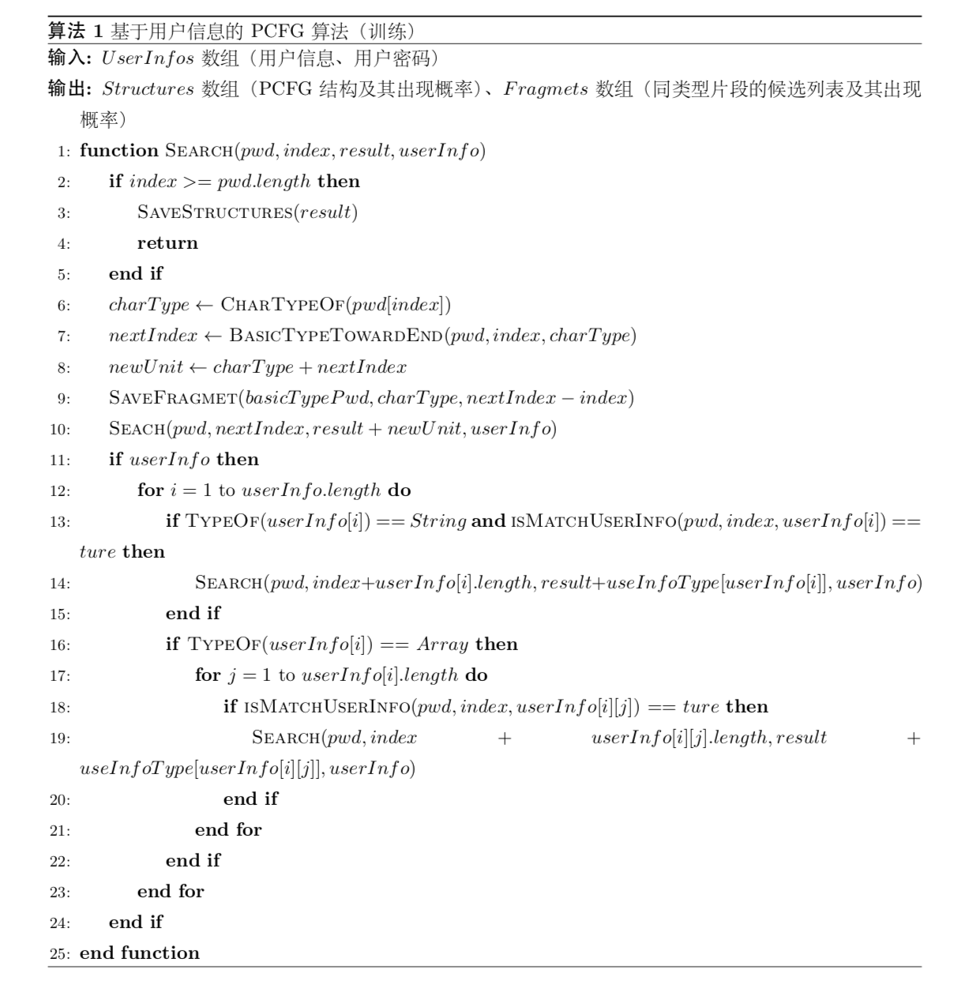

# PCFG-Base on the user information

## PCFG

`PCFG` 算法（全称 `Probabilistic Context-free grammer` 即概率上下文无关语法），顾名思义是一种不关心语法各个部分的关联性所带来的条件概率，而只关心语法各个部分本身的一种算法。最初该算法是用来做语法分析，在语法解析的过程中，是以一个完整的句子作为输入，以一颗对应的语法树作为输出的。在语法树的各个节点可以反映出单词的词性和与句中其他词的关系。上下文无关文法是对语言的一种抽象表示，即用四元祖 `G=(N,Σ,R,S)` 对句子进行描述。 `Σ` 是终止符，`N` 是非终止符， `S` 是特殊符号，`R` 是转换规则，即 `X→Y1…Yn,X∈N,Yi∈(N+Σ),n≥0`。 而在句子推导的过程中就会出现一个句子对应多颗句法树的情况，这多棵句法树会生成多个句子，其中就有一些并不符合句法的要求。所以概率上下文无关语法就应运而生，用来解决一个句子对应多颗句法树的问题。为每棵语法数给定一个概率值，概率值最大的那颗树就是句子所对应的句法树。

而在口令安全领域，早至2009年 `Weir` 等人就提出了一种全新的上下文无关文法(PCFG)攻击算法。从口令本身来说该算法提出了多种转换规则，即小写字母段转换为 `Ln`，大写字母段转换为 `Un`，数字段转换为 `Dn`，特殊符号段转换为 `Sn`，其中 `n` 是片段的长度。例如口令 `password123HELLO!` 将会转换为 `L8D3U5S1`，这其中就将所有的口令转化到了两个概率降序的集合中，一个是记录 `PCFG` 结构的集合，(即例子中的 `L8D3U5S1` 结构)，一个是记录同类型片段的集合（即例子中 `L8` 对应的片段 `password`, `D3` 对应的片段 `123`等）。而在生成口令时，采取概率降序枚举各部分的方法来生成口令，而一个生成口令的概率是等于结构的概率乘以每部分的概率，即 `P('password123HELLO') = P(L8D3U5S1) * P('password') * P('123') * P('HELLO') * P('!')`。该算法更多的是对训练集的结构特征进行归纳学习，所以对结构的生成能力非常的强，但是每个部分进行填充的部分仅仅是从训练集中生硬的获取后直接进行使用，导致填充部分缺少演化能力，并且在针对不同的测试用户时，没有可变性。

那么该算法在经典的 `PCFG` 算法基础上针对用户信息特征进行了修改、优化。在训练的过程中会添加更多的转换规则，并且这些规则在对用户信息特征进行统计分析后获得的，更能反映用户信息在口令中的表现情况。例如在上述的规则中添加了手机号码后4位为 `A1`，姓名首字母拼音为 `B1`两项规则后，`sw5541HELLO!` 对于首字母拼音为 `sw`，手机后4位为 `5541` 的用户将会被转换为多种结果 [`B1A1U5S1`, `B1D4U5S1`, `L2A1U5S1`, `L2D4U5S1`]，这在原规则的 `L2D4U5S1` 转换下新增了三种基于用户信息的转换。 在生成口令时，会概率降序枚举结构，然后枚举基础转换对应的同类型片段生成半成熟口令 `「username」「mobile」HELLO!`，然后再根据破解用户的信息填入用户信息转换部分获得成熟口令 `sw5541HELLO!`，因为用户信息是固定的，所以这里成熟口令的概率是等于 `P('sw5541HELLO!') = P(B1A1U5S1) * P(1) * P(1) * P('HELLO') * P('!')`。该方法在 `TarGuess` 论文中有提及，本文的实现上与之的区别是在拓展用户信息的转换时，同时保留了基本的转换规则，并且本文将用户信息片段全当作一个单位长度进行归纳，不受用户信息的长度的影响。下面我们通过流程图、伪代码和核心部分代码来具体地对算法进行了解。

## 训练算法

### 流程图


流程图中介绍了训练中的核心部分逻辑，整个训练部分是通过对每一个训练口令进行深度优先搜索来完成。在核心的搜索过程中，会先检查是否抵达搜索的边界条件，如果已经达到边界条件会保存最终的结构并进行回溯，否则的话会进行两部分的匹配。第一部分是进行基础转换规则的匹配，找到以该字符为首的最长的连续同类型片段，对片段进行保存后向后继续搜索，而第二部分是进行用户信息转换规则的匹配，这一步中会枚举用户的信息，尝试能否以该字符为首的字符串能与枚举的用户信息完全匹配，如果匹配的话向后继续搜索。完成搜索后就能获得上文中提到的两个集合。因为搜索是基于口令中每一个字符进行推进的，所以在口令长度限制的较短的情况下进行一次搜索的时间复杂度是很低的。

### 伪代码


由于篇幅关系，伪代码中只列出了核心搜索部分。这里简单介绍一下伪代码中使用到的参数和函数。首先是搜索的参数：`pwd` 是训练的口令，`index` 是现在该搜索的位置，`result` 是形成的口令结构，`userInfo` 是该用户的信息。

`SAVESTRUCTURES()` 函数是将最终的口令结构进行保存，`CHARTYPEOF()` 函数是获取该字符所属的基础类型，`BASICTYPETOWARDEND()` 函数是向后找到以该字符为首的最长的连续基础片段，`SAVEFRAGMENT()` 函数是将同类型片段进行保存。`TYPEOF()` 函数是获得一个对象的基础类型，`ISMATCHUSERINFO()` 函数是查看以该字符为首的字符串是否有能匹配到的用户信息。

### 核心代码

```Typescript
/**
   * 深度优先遍历该口令对应的所有结构
   * @param pwd         口令
   * @param index       现在搜索的位置下标
   * @param type        上一个字符所属类型
   * @param fragment    现在的碎片结果
   * @param result      最终PCFG结果
   * @param count       总量
   * @param userInfo    用户信息
   */
  private _search(
    pwd: string,
    index: number,
    result: string,
    count: number,
    userInfo?: UserInfo
  ) {
    if (index >= pwd.length) {
      this._saveStructure(result, count)
      return
    }
    const charType = this._charTypeof(pwd[index])
    // 基础PCFG
    const nextIndex = this._basicTypeTowardEnd(pwd, index, charType)
    this._saveFragmet(pwd.slice(index, nextIndex), charType, nextIndex - index, count)
    this._search(
      pwd,
      nextIndex,
      index === 0 ? `${charType}/${nextIndex - index}` : `${result},${charType}/${nextIndex - index}`,
      count,
      userInfo
    )
    // 拓展PCFG
    if (userInfo) {
      _.each(_.keys(this._userInfoType), userInfoKey => {
        const userInfoValue = userInfo[userInfoKey]
        switch (typeof userInfoValue) {
          case 'string':
            if (this._isMatchUserInfo(pwd, index, userInfoValue)) {
              this._search(
                pwd,
                index + userInfoValue.length,
                index === 0 ? this._userInfoType[userInfoKey] : `${result},${this._userInfoType[userInfoKey]}`,
                count,
                userInfo
              )
            }
            break
          case 'object':
            for (const userInfoUnit of userInfoValue) {
              if (this._isMatchUserInfo(pwd, index, userInfoUnit)) {
                this._search(
                  pwd,
                  index + userInfoUnit.length,
                  index === 0 ? this._userInfoType[userInfoKey] : `${result},${this._userInfoType[userInfoKey]}`,
                  count,
                  userInfo
                )
              }
            }
            break
          default:
        }
      })
    }
  }
```

## 攻击算法

### 流程图


攻击过程中最先是从结构中取出一个概率值最高的结构，然后会先对基础规则片段进行填充，填充值也是从对应的同类片段集合中各自以此取出概率最高的片段进行填充。当基础规则片段全部填充完成以后，就形成了一个半成熟口令。因为不同的测试口令均是使用相同的半成熟口令进行破解，所以本文会先生成所有的半成熟口令，以备后用，减小了算法的复杂度。在所有的半成熟口令生成完成以后，会按照概率降序进行攻击，攻击之前会将用户信息规则片段用相应的用户信息进行填充，形成成熟口令，然后与测试口令进行比对，如果命中的话，计数器加1，直到破解结束。

### 伪代码


由于篇幅关系，伪代码中只列出了关键的半成熟口令生成过程，这里介绍一下伪代码中的函数与变量。主函数参数中 `index` 是现在处理的结构中的单元的位置，`fragmentIndex` 是现在处理的基础类型片段中的单元位置，`probability` 是现目前半成熟口令的生成概率，`structures` 是这次需要生成的结构， `fragmentList` 是这次基础类型片段的候选值，`userInfo` 是用户信息。

`SAVEPWDPROBABILITY()` 函数是保存密码和相应的概率值，`ISUSERINFOFEATURE()` 函数是检查这个结构中的单元是不是用户信息类型片段，`REPLACECHARSOFUSERINFO()` 函数是用特殊标记替代用户信息类型片段，`COUNT()` 函数是计算这个基础类型片段候选值的总和。

### 核心代码

```Typescript
/**
   * 拼凑半成熟密码并计算出现的可能性
   * @param index           PCFG结构的遍历下标
   * @param basicIndex      fragmetList的遍历下标
   * @param probability     可能性
   * @param pwd             拼凑的密码
   * @param typeNumberList  PCFG结构数组
   * @param fragmetList     PCFG结构每个单元的候选列表
   * @param userInfo        用户信息
   */
  private _makeUpPassword(
    index: number,
    basicIndex: number,
    probability: number,
    pwd: string,
    typeNumberList,
    fragmetList,
    userInfo?: UserInfo
  ) {
    // 边界条件
    if (index >= typeNumberList.length) {
      // console.log(pwd, typeNumberList)
      redisClient.zadd(
        keys.REDIS_PCFG_PWD_PROBABILITY_KEY,
        probability.toString(),
        pwd
      )
      return
    }
    const typeNumber = typeNumberList[index]
    // tslint:disable-next-line
    const values: string[] = _.values(this._userInfoType) as any[]
    // 用户信息特征
    if (values.includes(typeNumber.type)) {
      const userInfoValue = this._userInfoMarkovType[this._typeToUserInfo[typeNumber.type]]
      if (!userInfoValue) {
        return
      }
      this._makeUpPassword(
        index + 1,
        basicIndex,
        probability,
        pwd + userInfoValue,
        typeNumberList,
        fragmetList,
        userInfo
      )
    // 普通特征
    } else {
      const fragmetTotal = _.reduce(
        _.map(fragmetList[basicIndex], f => f.value),
        function (sum, n) {
          return sum + n
        },
        0
      )
      for (const fragmet of fragmetList[basicIndex]) {
        this._makeUpPassword(
          index + 1,
          basicIndex + 1,
          probability * (fragmet.value / fragmetTotal),
          pwd + fragmet.key,
          typeNumberList,
          fragmetList,
          userInfo
        )
      }
    }
  }
```

