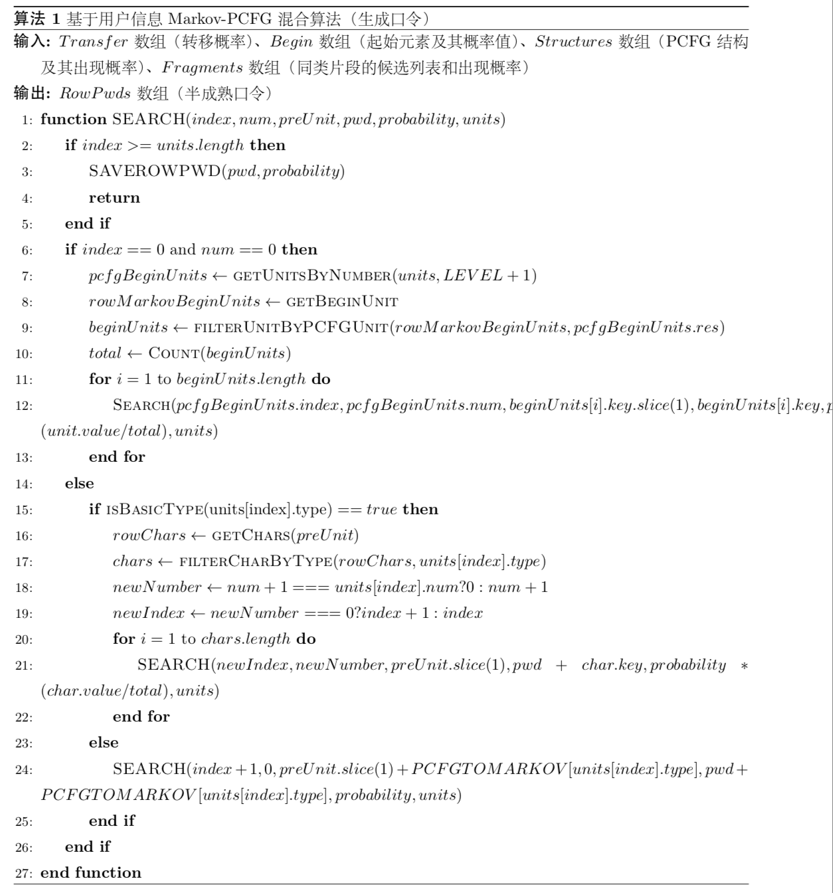

# Markov-PCFG

## 一种新的 `Markov-PCFG` 混合攻击算法

上文中我们介绍了 `Markov-chain` 方法和 `PCFG` 方法单独使用的弊端：

  + `PCFG`: 
    + 每个部分进行填充的部分仅仅是从训练集中生硬的获取后直接进行使用，导致填充部分缺少演化能力。
    + 在针对不同的测试用户时，没有可变性
  + `Markov-chain`:
    + 训练时只对字符之间的关系进行了归纳，而并不关系口令的结构组成，通过之前业内学者的研究证明口令中存在结构特点可循的，而不关系结构组成会导致生成很多非正常结构的无效测试口令，大大降低了我们破解的速度。
    + 不能很好的解决不同破解用户的各异性，破解口令对于所有的破解用户都相同，没有很好的使用用户信息。 

但是发现两者分别是对口令结构和口令字符间关系入手，是可以很好的相互融合的，所以设计了这种全新的基于 `Markov-chain` 和 `PCFG` 的混合攻击算法。该算法以 `PCFG` 结构为主，当确定一种 `PCFG` 结构以后，不使用传统的同类片段进行填充，而使用 `Markov-chain` 的思想进行填充（即先确定起始单元，再以概率递减遍历填充后序字符）。这样相互弥补了 `PCFG` 填充片段时缺少演化能力的问题，又弥补了 `Markov-chain` 会生成多种出现概率极少的非常规结构的口令，增加了口令生成命中的效率。例如 `password123` 在提取 `L8D3` 的结构后，生成口令时不会直接将 `L8` 对应的 `password`, `D3` 对应的 `123` 进行填充，而会对包含 `password123` 的训练集进行训练后进行 `Markov-chain` 的遍历填充。这里需要注意的是与传统马尔可夫链生成口令不同的是，不是所有起始单元和后序候选字符都是符合要求的，它们需要符合被填充位置的 `PCFG` 结构约束。

而对于两者都不能很好的使用用户信息的弊端，我们这里在对口令集进行训练的时候不选择传统的马尔可夫链和概率上下文无关文法算法进行训练。而是利用上文中提到的两种基于用户信息的加强方法，分别对口令进行训练，这样我们可以很好的解决上方提到的两种方法的弊端，而进行更高效的口令破解。

### 流程图


从流程图中，可以看到当攻击开始时，我们会取出一个概率值最高的 `PCFG` 结构进行填充。开始填充以后，我们会根据是否是首次填充来准备这次填充的候选值，如是首次填充则从起始单元集进行筛选符合结构的单元进行填充，如不是则从转移后序字符中筛选符合结构的单元进行填充。等到全部填充完毕以后获得半成熟口令（包含用户特征特殊符号的口令），全部 `PCFG` 结构都完成填充以后生成所有的半成熟口令，开始攻击。依次选取概率值最高的半成熟口令，使用用户的用户信息对半成熟口令中的标记部分进行填充，填充完毕以后生成成熟口令，查看口令是否命中，如果命中则计数器加1，直到使用了所有的生成口令或者破解了所有的测试口令。

### 伪代码


由于篇幅原因，这里只列出了生成口令的核心部分。因为生成的主逻辑是仿照 `Markov-chain` 的主逻辑，所以这里使用深度优先遍历算法来生成所有的口令，搜索的参数 `index` 是结构中的单元下标，`num` 是该单元的字符下标， `preUnit` 是前一个单元，`units` 是整个结构，`pwd` 是生成的半成熟口令。

`SAVEROWPWD()` 函数是用来存储半成熟口令，`GETUNITSBYNUMBER()` 函数是通过马尔可夫链的阶数来提取马尔可夫链的起始单元要覆盖多少个 `PCFG` 单元，`GETBEGINUNIT()` 函数是获取所有的起始单元，`FILTERUNITBYPCFGUNIT()` 函数是对所有的起始单元进行过滤，获得符合结构要求的起始单元。`COUNT()` 函数是计算符合要求的起始单元的总概率，`ISBASICTYPE()` 函数是用来判断是不是普通类型的字符，`GETCHARS()` 函数是用来获取所有的后序候选字符，`FILTERCHARBYTYPE()` 是过滤所有符合结构要求的字符。下面列出了该伪代码对应的核心代码。

### 核心代码

```Typescript
/**
   * 深度优先遍历出一个 PCFG 结构的密码
   * @param index           第几个PCFG单元
   * @param num             现PCFG单元中的第几个字符
   * @param preUnit         前一个PCFG单元
   * @param units           PCFG结构
   * @param pwd             最终的密码
   */
  private async _search(
    index: number,
    num: number,
    preUnit: string,
    pwd: string,
    probability: number,
    units: PCFGUnit[]
  ) {
    if (index >= units.length) {
      // console.log(pwd, probability)
      redisClient.zadd(keys.REDIS_MARKOV_PCFG_PWD_PROBABILITY_KEY, probability.toString(), pwd.replace(/，/g, ''))
      return
    }
    // 起始
    if (index === 0 && num === 0) {
      const pcfgBeginUnits = this._getUnitsByNumber(units, this._level + 1)
      const rowMarkovBeginUnits = await zrevrange(keys.REDIS_MARKOV_FRAGMENT_KEY, 0, -1, 'WITHSCORES')
      // 拿出符合条件的 Markov begin units
      const beginUnits = this._filterUnitByPCFGUnit(rowMarkovBeginUnits, pcfgBeginUnits.res)
      const total = this._calculateTotalOfSortedset(beginUnits)
      for (const unit of beginUnits) {
        await this._search(
          pcfgBeginUnits.index,
          pcfgBeginUnits.num,
          unit.key.split('，').slice(1).join('，'),
          unit.key.replace('/，/g', ''),
          probability * (unit.value / total),
          units
        )
      }
    // tslint:disable-next-line
    } else {
      // 基础类型
      if (this._basicTypeList.includes(units[index].type)) {
        const rowChars = await zrevrange(
          keys.REDIS_MARKOV_TRANSFER_KEY.replace(/{{word}}/, preUnit),
          0, -1, 'WITHSCORES'
        )
        const chars = this._filterCharByType(rowChars, units[index].type)
        const total = this._calculateTotalOfSortedset(chars)
        const newNumber = num + 1 === units[index].num ? 0 : num + 1
        const newIndex = newNumber === 0 ? index + 1 : index
        for (const char of chars) {
          await this._search(
            newIndex,
            newNumber,
            preUnit.split('，').slice(1).join('，') + `，${char.key}`,
            pwd + char.key,
            probability * (char.value / total),
            units
          )
        }
      } else {
        // 用户信息类型
        await this._search(
          index + 1,
          0,
          preUnit.split('，').slice(1).join('，') + `，${this._pcfgTypeToMarkovType[units[index].type]}`,
          pwd + this._pcfgTypeToMarkovType[units[index].type],
          probability,
          units
        )
      }
    }
  }
```
